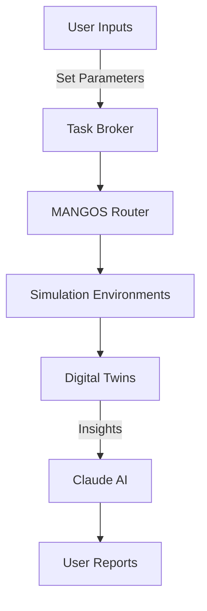

# ecosystem-sim

## Overview

Welcome to **ecosystem-sim**—a cutting-edge software ecosystem designed for simulation environments, digital twins, and scenario modeling. As part of the broader 40+ ecosystem AI-infrastructure estate provided by DCoop HQ, ecosystem-sim leverages advanced artificial intelligence frameworks and infrastructure components, including a task broker, a MANGOS cost-first router, and Claude, to create powerful, scalable, and efficient simulation tools.

## Table of Contents

- [Features](#features)
- [Architecture](#architecture)
- [Installation](#installation)
- [Usage](#usage)
- [Contributing](#contributing)
- [Governance](#governance)
- [License](#license)
- [Contact](#contact)

## Features

- **Simulation Environments**: Create and manipulate virtual environments tailored to your specific use cases.
- **Digital Twins**: Develop real-time digital counterparts for physical systems, enabling high-fidelity monitoring and analysis.
- **Scenario Modeling**: Build, run, and evaluate multiple scenarios to ascertain optimal strategies and outcomes.
- **Integration**: Seamless integration with other DCoop HQ ecosystems and services using the task broker for scheduling and resource allocation.
- **Cost Optimization**: Benefit from MANGOS, the cost-first routing system, ensuring efficient resource management.
- **AI-Powered Insights**: Leverage Claude to receive actionable insights based on simulations and data analysis.

## Architecture

The architecture of ecosystem-sim consists of several key components:

- **Task Broker**: Manages workloads and ensures balanced task distribution across the network of simulations.
- **MANGOS Router**: Provides cost-effective data routing and processing, optimizing performance for simulations and digital twins.
- **Claude AI**: Offers advanced analytics and decision-making support based on scenario modeling outcomes.



## Installation

To install ecosystem-sim, follow these steps:

1. Clone the repository:
   ```bash
   git clone https://github.com/yourusername/ecosystem-sim.git
   cd ecosystem-sim
   ```

2. Install dependencies:
   ```bash
   pip install -r requirements.txt
   ```

3. Run the setup script:
   ```bash
   python setup.py install
   ```

4. Verify the installation:
   ```bash
   python -m ecosystem_sim --version
   ```

## Usage

### Running a Simulation

To run a basic simulation, use the command line interface:

```bash
ecosystem_sim run --config path/to/config.yaml
```

### Creating a Digital Twin

To create a digital twin from an existing physical asset:

```bash
ecosystem_sim create-digital-twin --asset-id "asset_123" --config path/to/twin_config.yaml
```

### Scenario Modeling

For scenario modeling, define your scenarios in YAML and execute:

```bash
ecosystem_sim model-scenario --scenario path/to/scenario.yaml
```

## Contributing

We welcome contributions to ecosystem-sim! To contribute, please follow these steps:

1. Fork the project repository.
2. Create a new branch (`git checkout -b feature/your-feature`).
3. Make your changes and commit them (`git commit -m "Add new feature"`).
4. Push to the branch (`git push origin feature/your-feature`).
5. Create a pull request on GitHub.

Please ensure that your code follows the established coding standards and includes tests where applicable.

## Governance

The governance of ecosystem-sim is managed by a set of guidelines outlined in `governance.yaml`. Below is the content of the governance file:

```yaml
version: "1.0"

governance:
  roles:
    - name: Project Lead
      responsibilities:
        - Oversee project direction
        - Approve major releases
    - name: Contributor
      responsibilities:
        - Submit code changes
        - Review other contributors' pull requests
  decision-making:
    process:
      - Propose changes
      - Discuss in issue tracker
      - Vote on proposals (if needed)
  code_of_conduct: 
    rules:
      - Respect others
      - No harassment
      - Be inclusive
  meetings:
    frequency: monthly
    platform: Zoom
    agenda:
      - Project updates
      - New feature discussions
      - Open floor for questions
```

## License

This project is licensed under the MIT License. See the [LICENSE](LICENSE) file for details.

## Contact

For more information, questions, or support, please reach out to the project maintainers at:

- Email: support@ecosystem-sim.org
- GitHub: [ecosystem-sim](https://github.com/yourusername/ecosystem-sim)

Thank you for your interest in ecosystem-sim! We look forward to your contributions and feedback as we grow this powerful ecosystem together.
